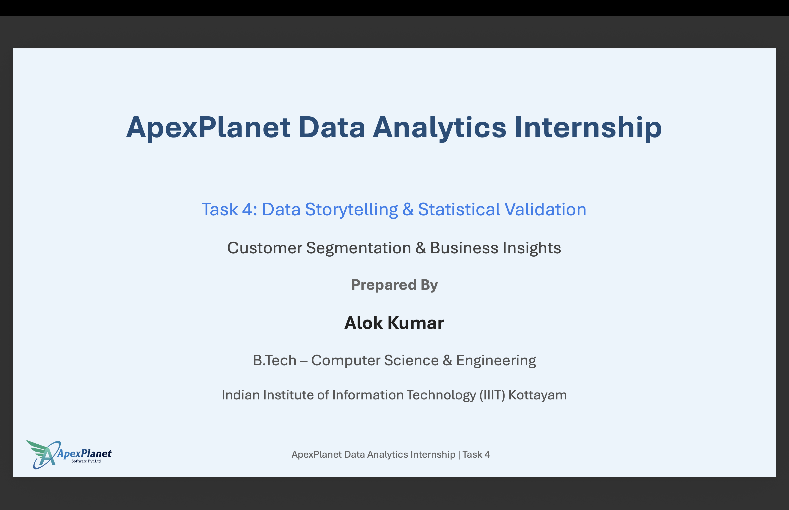

# 📊 ApexPlanet Data Analytics Internship Portfolio

Welcome to my **ApexPlanet Data Analytics Internship Portfolio**.

This repository serves as the central portfolio showcasing all projects completed during my **Data Analytics Internship at ApexPlanet Software Pvt. Ltd.**

Throughout this internship, I transformed raw sales data into actionable business insights using **Python, SQL, Tableau Public, and Statistical Analysis**. Each task built upon the previous one, resulting in a complete end-to-end data analytics workflow—from **data cleaning and preparation** to **exploratory analysis, customer segmentation, statistical validation, business storytelling, and interactive dashboard development**.

---

# 📷 Portfolio Preview

The image below shows the homepage of this internship portfolio.



---

# 👨‍💻 About Me

**Alok Kumar**

**B.Tech – Computer Science & Engineering**

**Indian Institute of Information Technology (IIIT) Kottayam**

🔗 **GitHub:** https://github.com/alokkumar-dotcom

🔗 **LinkedIn:** https://www.linkedin.com/in/alok-kumar-b19a2835b/

📊 **Tableau Public:** https://public.tableau.com/app/profile/alok.kumar3178

---

# 📁 Portfolio Structure

```text
alokkumar-DataAnalyst-Internship-Portfolio/

├── README.md
├── portfolio_preview.png
└── presentation/
    └── final_presentation.pdf
```

---

# 🚀 Internship Projects

| Task | Project | Repository |
|------|---------|------------|
| **Task 1** | Data Cleaning & Preparation | https://github.com/alokkumar-dotcom/ApexPlanet-DataAnalytics-Task1 |
| **Task 2** | Exploratory Data Analysis (EDA), SQL & Tableau Dashboard | https://github.com/alokkumar-dotcom/ApexPlanet-DataAnalytics-Task2 |
| **Task 3** | Customer Segmentation & Interactive Tableau Dashboard | https://github.com/alokkumar-dotcom/ApexPlanet-DataAnalytics-Task3 |
| **Task 4** | Data Storytelling & Statistical Validation | https://github.com/alokkumar-dotcom/ApexPlanet-DataAnalytics-Task4 |

---

# 📌 Project Highlights

## 📌 Task 1 – Data Cleaning & Preparation

Prepared raw sales data for analysis by:

- Handling missing values
- Removing duplicate records
- Validating data quality
- Performing feature engineering

### Key Skills

- Python
- Pandas
- Data Cleaning
- Data Validation
- Feature Engineering

---

## 📌 Task 2 – Exploratory Data Analysis (EDA), SQL & Tableau Dashboard

Performed Exploratory Data Analysis (EDA), answered business questions using SQL, and developed an interactive Tableau dashboard to visualize key business metrics.

### Key Skills

- Exploratory Data Analysis (EDA)
- SQL & MySQL
- Tableau Public
- Data Visualization
- Business Analytics

---

## 📌 Task 3 – Customer Segmentation & Interactive Tableau Dashboard

Performed customer segmentation using purchasing behavior, generated business insights, and developed an interactive Tableau dashboard to support customer analysis and business decision-making.

### Key Skills

- Customer Segmentation
- KPI Development
- Tableau Dashboards
- Business Intelligence
- Data Storytelling

---

## 📌 Task 4 – Data Storytelling & Statistical Validation

Integrated the complete analytics workflow into a business-focused narrative and validated customer spending differences using Welch's Independent Samples t-test.

### Key Skills

- Data Storytelling
- Statistical Testing
- Hypothesis Testing
- SciPy
- Business Recommendations
- Presentation Design

---

# 📊 Tableau Public

Explore all interactive dashboards created during the internship.

### 🔗 Tableau Public Profile

https://public.tableau.com/app/profile/alok.kumar3178

---

# 🛠️ Technologies & Tools

| Category | Technologies |
|----------|--------------|
| Programming | Python |
| Libraries | Pandas, Matplotlib, SciPy |
| Database | SQL, MySQL |
| Data Visualization | Tableau Public |
| Version Control | Git, GitHub |
| Development Environment | Visual Studio Code |

---

# 📈 Key Learning Outcomes

Throughout this internship, I gained hands-on experience in:

- Cleaning and preparing real-world datasets for analysis.
- Performing Exploratory Data Analysis (EDA).
- Writing SQL queries to solve business problems.
- Developing interactive Tableau dashboards.
- Performing customer segmentation using purchasing behavior.
- Generating actionable business insights through data analysis.
- Validating business findings using statistical hypothesis testing.
- Presenting analytical results through professional reports and presentations.
- Managing analytics projects using Git and GitHub.

---

# 📄 Final Presentation

The final presentation summarizes the complete internship journey, including:

- Data Cleaning & Preparation
- Exploratory Data Analysis (EDA)
- SQL Analysis
- Customer Segmentation
- Tableau Dashboards
- Data Storytelling
- Statistical Validation
- Business Recommendations

### 📄 Presentation

[Final Internship Presentation](presentation/final_presentation.pdf)

---

# 🤝 Connect With Me

- 🔗 GitHub: https://github.com/alokkumar-dotcom
- 💼 LinkedIn: https://www.linkedin.com/in/alok-kumar-b19a2835b/
- 📊 Tableau Public: https://public.tableau.com/app/profile/alok.kumar3178

---

# ⭐ Thank You

Thank you for visiting my portfolio.

I hope these projects demonstrate my knowledge and practical experience in:

- Data Analytics
- Data Cleaning
- Exploratory Data Analysis (EDA)
- SQL & Database Analysis
- Tableau Dashboard Development
- Business Intelligence
- Customer Segmentation
- Statistical Analysis
- Data Storytelling

If you found this portfolio useful, feel free to:

⭐ Star the repositories

📂 Explore the internship projects

💼 Connect with me on LinkedIn

📊 View my Tableau dashboards

Your feedback and suggestions are always welcome.
